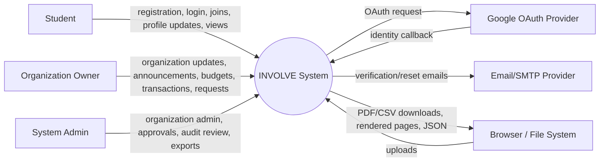
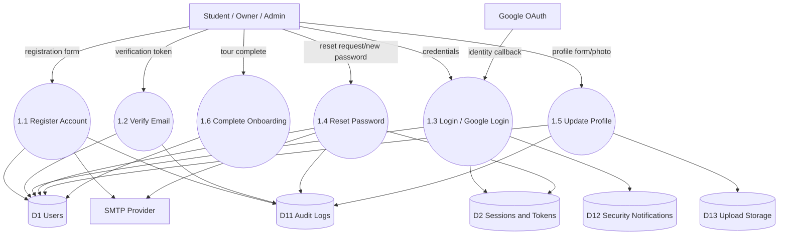
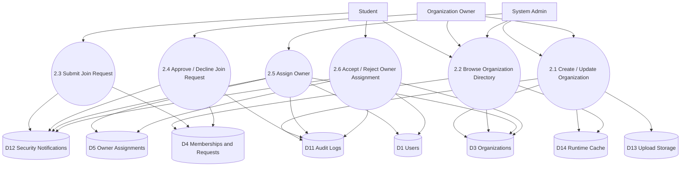
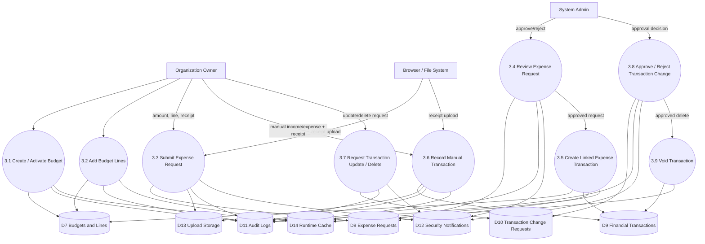
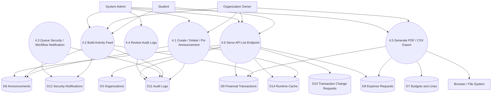
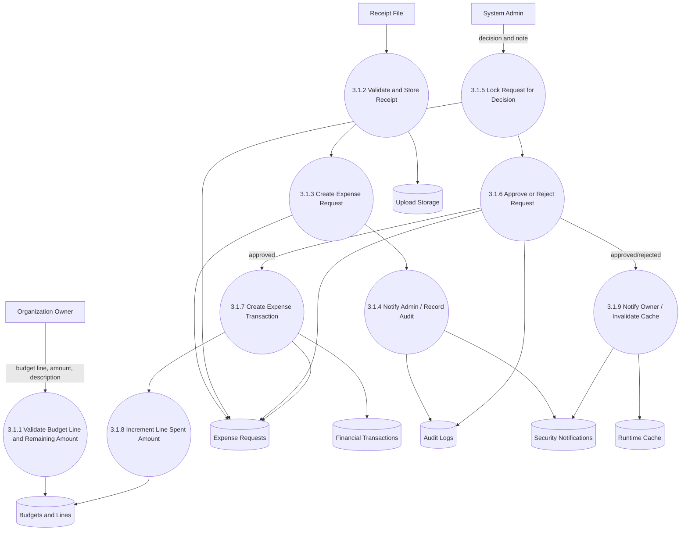
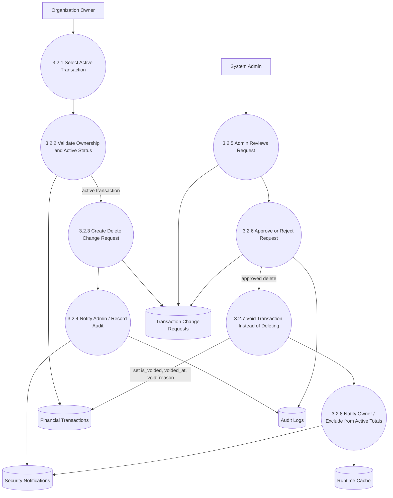
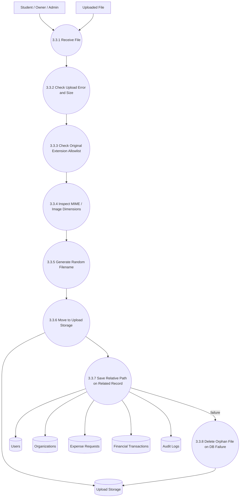
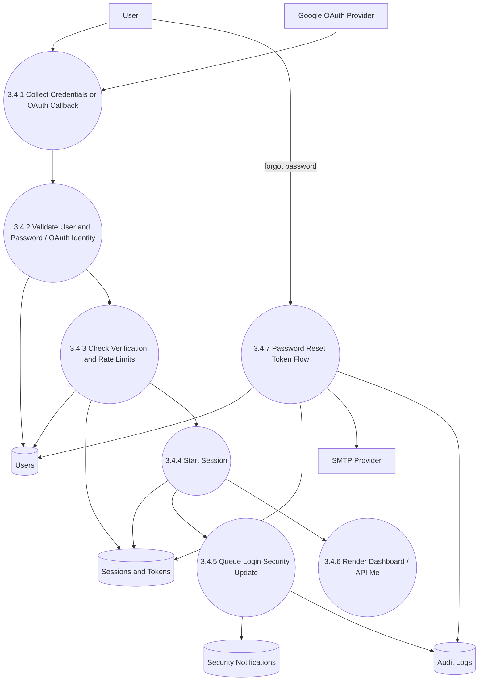

# INVOLVE Data Flow Diagram

Last reviewed: May 11, 2026

## Purpose
This document describes the data flow of the INVOLVE Student Organization Management and Budget Transparency System from context level through selected Level 3 flows. It is intended for system defense, maintenance, and future architecture updates.

## DFD Scope
- Existing web routes under `index.php`, `?page=...`, and `?action=...`.
- Existing JSON endpoints under `/api`.
- Session-based authentication, CSRF, uploads, notifications, audit logs, and exports.
- Current PHP/PDO database stores and upload folders.

## Mermaid Source Files
The diagrams below are embedded in this Markdown file and also available as standalone Mermaid files for editor preview extensions:
- [Level 0 Context](mermaid/dfd-level-0-context.mmd)
- [Level 1 Major Processes](mermaid/dfd-level-1-major-processes.mmd)
- [Level 2 Finance Approval](mermaid/dfd-level-2-finance-approval.mmd)
- [Level 3 Clean System Overview](mermaid/dfd-level-3-clean-system.mmd)
- [Level 3 Void Transaction](mermaid/dfd-level-3-void-transaction.mmd)

## External Entities
- **Student:** browses organizations, joins organizations, reviews updates, and manages profile data.
- **Organization Owner:** manages assigned organization profile, announcements, members, budgets, expense requests, and transactions.
- **System Admin:** manages organizations, owner assignments, approvals, budgets, audit logs, and reports.
- **Email/SMTP Provider:** sends verification, reset, and notification emails.
- **Google OAuth Provider:** provides optional Google sign-in identity data.
- **Browser/File System:** provides uploaded files and receives generated PDF/CSV exports.

## Data Stores
- **D1 Users:** account, role, profile, verification, and onboarding data.
- **D2 Sessions and Tokens:** session records, reset tokens, remember/login metadata.
- **D3 Organizations:** organization profile, ownership, visibility, and branding data.
- **D4 Memberships and Requests:** organization members and join requests.
- **D5 Owner Assignments:** owner assignment workflow records.
- **D6 Announcements:** organization announcements, pins, labels, and expiry.
- **D7 Budgets and Lines:** budgets, line items, allocations, spent and pending amounts.
- **D8 Expense Requests:** budget-backed expense requests, receipts, admin decisions, linked transactions.
- **D9 Financial Transactions:** income/expense records, receipts, void status, void reason, linked expense request.
- **D10 Transaction Change Requests:** owner update/delete requests and admin decisions.
- **D11 Audit Logs:** captured critical actions and entity references.
- **D12 Security Notifications:** request/security updates shown to users.
- **D13 Upload Storage:** user photos, organization logos, receipts, bundled media.
- **D14 Runtime Cache:** cached safe aggregate/list data.

## Level 0: Context Diagram

## Level 1: Major System Processes

```mermaid
flowchart TB
    Student[Student]
    Owner[Organization Owner]
    Admin[System Admin]
    OAuth[Google OAuth]
    Mail[SMTP Provider]
    Files[Browser / File System]

    P1((1.0 Authentication and Account))
    P2((2.0 Organization Management))
    P3((3.0 Membership and Ownership))
    P4((4.0 Announcements))
    P5((5.0 Budget and Expense Requests))
    P6((6.0 Financial Transactions))
    P7((7.0 Admin Review and Audit))
    P8((8.0 Notifications and Activity Feeds))
    P9((9.0 Reports, Exports, and API Lists))
    P10((10.0 Upload Handling))

    D1[(D1 Users)]
    D2[(D2 Sessions and Tokens)]
    D3[(D3 Organizations)]
    D4[(D4 Memberships and Requests)]
    D5[(D5 Owner Assignments)]
    D6[(D6 Announcements)]
    D7[(D7 Budgets and Lines)]
    D8[(D8 Expense Requests)]
    D9[(D9 Financial Transactions)]
    D10[(D10 Transaction Change Requests)]
    D11[(D11 Audit Logs)]
    D12[(D12 Security Notifications)]
    D13[(D13 Upload Storage)]
    D14[(D14 Runtime Cache)]

    Student --> P1
    Owner --> P1
    Admin --> P1
    OAuth --> P1
    P1 --> D1
    P1 --> D2
    P1 --> Mail

    Student --> P2
    Owner --> P2
    Admin --> P2
    P2 --> D3
    P2 --> D11

    Student --> P3
    Owner --> P3
    Admin --> P3
    P3 --> D4
    P3 --> D5
    P3 --> D11
    P3 --> D12

    Owner --> P4
    Admin --> P4
    P4 --> D6
    P4 --> D11
    P4 --> D14

    Owner --> P5
    Admin --> P5
    P5 --> D7
    P5 --> D8
    P5 --> D9
    P5 --> D11
    P5 --> D12

    Owner --> P6
    Admin --> P6
    P6 --> D9
    P6 --> D10
    P6 --> D11
    P6 --> D12

    Admin --> P7
    P7 --> D8
    P7 --> D10
    P7 --> D11

    Student --> P8
    Owner --> P8
    Admin --> P8
    P8 --> D6
    P8 --> D10
    P8 --> D11
    P8 --> D12

    Student --> P9
    Owner --> P9
    Admin --> P9
    P9 --> D3
    P9 --> D6
    P9 --> D7
    P9 --> D8
    P9 --> D9
    P9 --> D11
    P9 --> D14
    P9 --> Files

    Student --> P10
    Owner --> P10
    Admin --> P10
    P10 --> D13
    P10 --> D11
```

## Level 2: Core Workflows

### 2.1 Authentication and Account

### 2.2 Organization, Membership, and Ownership

### 2.3 Finance, Budgeting, and Admin Approval

### 2.4 Announcements, Notifications, Audit, and Reports

## Level 3: Critical Detailed Flows

### 3.1 Expense Request Approval to Linked Transaction

### 3.2 Transaction Delete Request to Voided Record

### 3.3 Upload Validation and Storage

### 3.4 Login, Session, and Security Notification

## Data Dictionary
| ID | Store | Main Data | Used By |
| --- | --- | --- | --- |
| D1 | Users | identity, role, email verification, profile, onboarding | auth, permissions, owner assignment, notifications |
| D2 | Sessions and Tokens | active sessions, reset tokens, login metadata | login, logout, reset password |
| D3 | Organizations | name, description, scope, logo, owner | directory, admin orgs, owner workspace |
| D4 | Memberships and Requests | members, join request status | join workflow, owner member review |
| D5 | Owner Assignments | pending/accepted/rejected owner assignments | admin assignment and student response |
| D6 | Announcements | title, content, label, pin, expiry | dashboard activity, organization pages |
| D7 | Budgets and Lines | budget periods, totals, line allocations/spend | owner budget workspace, admin budget overview |
| D8 | Expense Requests | request amount, status, receipt, admin note, linked transaction | BudgetFlow approval |
| D9 | Financial Transactions | income/expense, amount, receipt, void status | reports, dashboards, exports, transaction history |
| D10 | Transaction Change Requests | update/delete proposals, status, admin note | admin approvals, owner request trail |
| D11 | Audit Logs | action, actor, entity, source details | admin audit, transparency trail |
| D12 | Security Notifications | login/security/request updates | notification center, popups |
| D13 | Upload Storage | profile images, org logos, receipts, assets | upload workflows, receipt viewing, branding |
| D14 | Runtime Cache | safe aggregate/list cache entries | dashboard, public counts, API list reads |

## Control and Security Notes
- Mutating web actions use CSRF validation.
- Role and permission checks are enforced through `can()` and `requirePermission()`.
- Uploads validate size, original extension, MIME type, and image dimensions where applicable.
- Profile and organization images are decoded and re-saved before storage; receipt files keep their validated original payload for audit visibility.
- Financial transaction delete approvals void records instead of removing rows.
- Voided transactions remain visible but are excluded from active totals and blocked from further update/delete requests.
- Audit logs and notifications are written around critical workflows.
- Cache stores only safe aggregate/list data, never sessions, CSRF tokens, passwords, reset tokens, or current-user state.

## Current Gaps and Future DFD Updates
- A future public transparency portal should add a dedicated Level 2 reporting/transparency DFD.
- If API token authentication is added, Level 2 authentication should split session auth from token auth.
- If Redis/APCu/WebSockets are introduced, D14 and notification flows should be updated.
- If upload storage moves outside the web root or into object storage, D13 should be revised.
